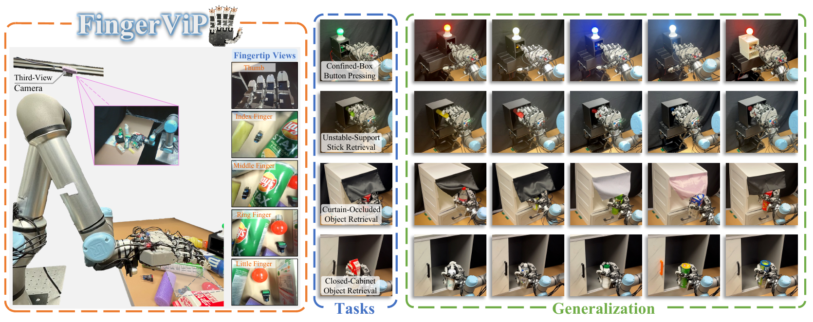
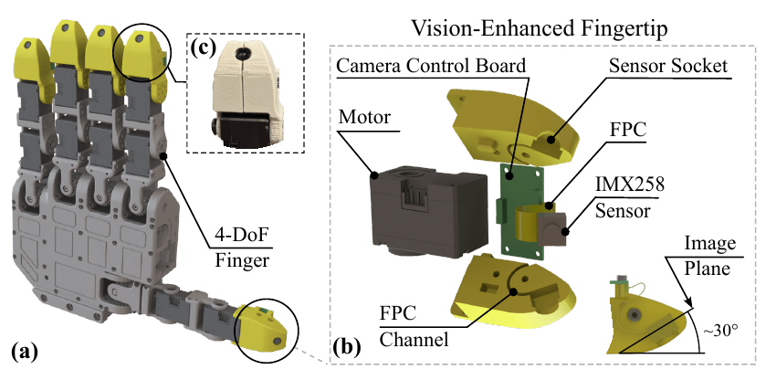
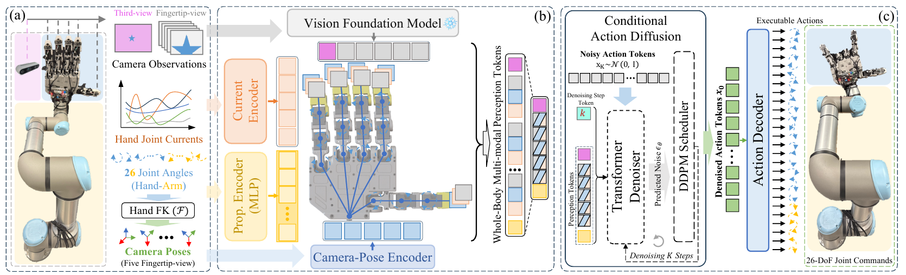

# FingerViP: Learning Real-World Dexterous Manipulation with Fingertip Visual Perception

**Conference on Robot Learning (CoRL) 2026**

[Zhen Zhang](https://zhzhen0626.github.io/)<sup>1</sup>, Weinan Wang<sup>1*</sup>, Hejia Sun<sup>2*</sup>, Qingpeng Ding<sup>1</sup>, [Xiangyu Chu](https://xiangyuchu03.github.io/)<sup>1,4</sup>, [Guoxin Fang](https://guoxinfang.github.io/)<sup>1,3</sup>, [K. W. Samuel Au](https://www4.mae.cuhk.edu.hk/peoples/au-kwok-wai-samuel/)<sup>1,4</sup>

<sup>1</sup> The Chinese University of Hong Kong · <sup>2</sup> The Hong Kong Polytechnic University<br>
<sup>3</sup> Centre for Perceptual and Interactive Intelligence, CUHK · <sup>4</sup> Multi-Scale Medical Robotics Center, AIR@InnoHK<br>
<sub><sup>*</sup> Equal contribution</sub>

[[Project Page](https://fingervip.github.io/)] · [[Paper](https://arxiv.org/abs/2604.21331)] · [[Video](https://youtu.be/gGeq8-RoLE0)] · [[Citation](#citation)]

<p align="center">
  
</p>

## 👋 Introduction

**FingerViP** learns dexterous arm–hand manipulation from human demonstrations using five fingertip cameras and a third-view camera.

The repository includes:

- **[Hardware](Hardware/README.md):** fingertip designs, assembly and motor setup.
- **[Teleop](Teleop/README.md):** Vision Pro teleoperation and data collection.
- **[DiffusionPolicy](#policy-training):** data conversion, policy training and inference.

## 🛠️ Hardware Design

Each fingertip integrates a miniature SONY IMX258 USB camera into a compact, modular shell for multi-view visual perception.

<p align="center">
  
</p>

See the [fingertip assembly guide and BOM](Hardware/mechanical_structure/README.md) and the [original RAPID Hand structure](https://github.com/SYSU-RoboticsLab/RAPID-Hand) for mechanical details.

## 🧠 Visuomotor Policy

FingerViP combines multi-view images, camera poses and finger joint currents in a diffusion policy for coordinated arm–hand control.

<p align="center">
  
</p>

## 🚀 Installation and Usage

```bash
git clone https://github.com/zhzhen0626/FingerViP.git
cd FingerViP
```

<a id="environment"></a>

Create the shared `fingervip` environment (Ubuntu 20.04, Conda):

```bash
cd DiffusionPolicy
conda env create -f environment.yml
conda activate fingervip
python -m pip install -r ../Hardware/requirements.txt -r ../Teleop/requirements.txt
python -m pip check
cd ..
```

### 1. Assemble and calibrate the hand

Assemble the hand using the [hardware guide](Hardware/README.md), then follow [Teleop motor calibration](Teleop/README.md#motor-calibration) for the integrated system.

### 2. Configure devices and collect demonstrations

Follow the [teleoperation guide](Teleop/README.md) to configure devices and collect demonstrations with Vision Pro.

### 3. Set up and train the policy

From the repository root, enter the policy directory:

```bash
conda activate fingervip
cd DiffusionPolicy
```

#### Process demonstrations

Copy individual `.zarr` episodes from `Teleop/data/test_data/<session>/` into:

```text
diffusion_policy/data/raw_zarr_data/my_task/
├── episode_001.zarr/
└── episode_002.zarr/
```

Each episode must contain five fingertip views and the third view:

```bash
python diffusion_policy/process_data.py \
  --task_name my_task --prefix train \
  --urdf_file ur5e_with_rapid_hand_right_fingercamera.urdf \
  --handbase_transform_mask 1,1,1,1,1
```

Output: `diffusion_policy/data/processed_zarr_zip/my_task_train/dataset.zarr.zip`. Change the task/prefix to avoid overwriting. Hint: add `--render` for previews.

Optional recording inspection:

```bash
python diffusion_policy/inspect_recording.py \
  diffusion_policy/data/raw_zarr_data/my_task/episode_001.zarr --list
```

#### Policy training

Set the absolute path to the converted ZIP:

```bash
python diffusion_policy/train_fingervip.py \
  --config-name=train_fingervip_workspace \
  task.dataset_path=/absolute/path/to/dataset.zarr.zip \
  logging.mode=offline
```

Configuration: [Training](DiffusionPolicy/diffusion_policy/config/train_fingervip_workspace.yaml) · [Observations](DiffusionPolicy/diffusion_policy/config/task/fingervip.yaml) · [Dataset](DiffusionPolicy/diffusion_policy/config/task/base.yaml).

<details>
<summary>Multi-GPU training</summary>

```bash
accelerate launch --multi_gpu --num_processes 2 diffusion_policy/train_fingervip.py \
  --config-name=train_fingervip_workspace \
  task.dataset_path=/absolute/path/to/dataset.zarr.zip \
  logging.mode=offline
```

</details>

<a id="deployment"></a>

### 4. Deploy the policy

**Synthetic-input check** (CUDA required; no robot motion):

```bash
python diffusion_policy/eval_fingervip.py /absolute/path/to/model.ckpt
```

**Real robot:** complete [Teleoperation setup](Teleop/README.md#environment) and [device configuration](Teleop/README.md#configuration). In a new terminal at the repository root:

```bash
conda activate fingervip
source /path/to/ros1_workspace/devel/setup.bash
```

Move the arm to its initial pose:

```bash
cd Teleop
python control/ur5e_control/scripts/move_to_init_position.py --robot_ip <ROBOT_IP>
```

Start `roscore` in another terminal with ROS loaded. From `Teleop/`, run evaluation instead of `robot_node.py` (startup moves the arm and hand):

```bash
python eval_robot_node.py args/teleop_args.yaml /absolute/path/to/model.ckpt
```

Controls: `c` start · `s` record · `q` stop, choose whether to save, and reset. Press Enter after each command and wait for saving to finish.

<a id="citation"></a>

## 📖 Citation

If you use FingerViP in your research, please cite:

```bibtex
@article{zhang2026fingervip,
  title={FingerViP: Learning Real-World Dexterous Manipulation with Fingertip Visual Perception},
  author={Zhang, Zhen and Wang, Weinan and Sun, Hejia and Ding, Qingpeng and Chu, Xiangyu and Fang, Guoxin and Au, KW},
  journal={arXiv preprint arXiv:2604.21331},
  year={2026}
}
```

<a id="license"></a>

## 📄 License

This repository is released under the [MIT license](LICENSE). Third-party code and derivative works retain their respective licenses.

## 🙏 Acknowledgements

Hardware and teleoperation build on [RAPID Hand](https://github.com/SYSU-RoboticsLab/RAPID-Hand). Our policy implementation is adapted from [RoboPanoptes](https://github.com/real-stanford/RoboPanoptes) and [UMI](https://github.com/real-stanford/universal_manipulation_interface). We thank the authors for sharing their work.
